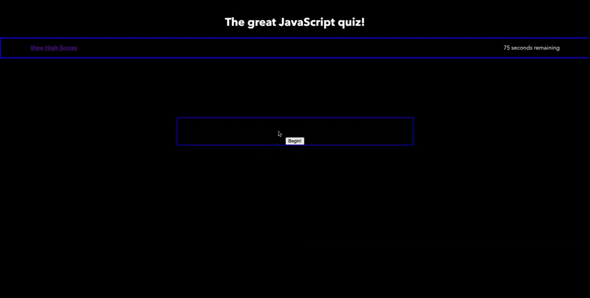

# Password Generator with User Prompts

## Description

This webpage hosts a five question quiz on some of the topics covered in the Bootcamp JavaScript module. The quiz is timed, and scored based on remaining time when the user answers all questions. Once the quiz is finished, the user is prompted to enter their initials. If they had one of the ten best scores, they will enter the hall of fame.

[Web Quiz](https://sam-lerner.github.io/sam-lerner-web-quiz/ "Go to the Website!")

## Mock-Up

The following is an animation of the expected website interaction:

## Installation

N/A

## Usage

Simply click the begin button in the middle of the screen to start the quiz. The timer, located in the top right corner, will begin to count down. Feedback is given as to the correctness of the answer selected, and time is deducted for wrong answers. The user may only advance once they get the question right. Once all questions are answered or time runs out, the entry form appears with the prompt for entering in initials. Clicking sumbit automatically takes the user to the high score page.

## Credits

Thank you to classmate Eric Kirberger, tutor Dru Sanchez, TAs Paul Cwik and Manoli Koutouzos for their guidance with this project. 

## License

N/A

## Badges

